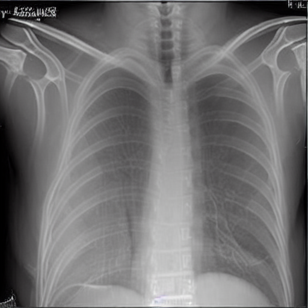

# CuraBot: A Medical AI Assistant System


CuraBot is an intelligent medical assistant system designed to enhance healthcare support through three integrated modules. The first module is **a Medical Chatbot**, built using large language models (LLMs) fine-tuned on medical data to deliver accurate and conversational responses to a wide range of health-related queries. The second module is **Symptom-Based Image Generation**, which leverages a diffusion model to generate medical illustrations based on user-provided symptom descriptions—offering a visual understanding of potential conditions. The third module focuses on **Brain Tumor Segmentation**, utilizing a fine-tuned YOLOv11 model trained on a custom dataset to detect and segment brain tumors from MRI scans with high precision. Together, these modules form a comprehensive AI-driven system aimed at improving medical awareness, diagnostic support, and user engagement in healthcare.


## 📌 Project Structure

Main Component:

- **Medical Chatbot** — Built by fine-tuning two powerful open-source LLMs:

  - [Qwen2.5-3B-Instruct](https://huggingface.co/Qwen/Qwen2.5-3B-Instruct) by Alibaba
  
  - [LLaMA-3.1-8B](https://huggingface.co/meta-llama/Llama-3.1-8B) by Meta
  
  Both models are fine-tuned on the [ChatDoctor-HealthCareMagic-100k](https://huggingface.co/datasets/lavita/ChatDoctor-HealthCareMagic-100k) dataset, which contains real-world medical Q&A pairs.

## 🧠 Model 1: Qwen2.5-3B-Instruct

### 🔧 Training Pipeline Summary

- **Quantization**: 4-bit via `bitsandbytes` for efficient training

- **PEFT Method**: LoRA (`peft` library)

- **Dataset**: 5,000 samples manually split: 4k for training, 500 for validation, 500 for testing

- **Frameworks**: Transformers, Datasets, PEFT, TRL

### 🛠️ Technologies Used

- `transformers`

- `datasets`

- `bitsandbytes`

- `peft`

- `trl`

- `accelerate`

- `torch`


### You can use my model from this code:

```python
!pip install transformers peft bitsandbytes
```

```python
import torch
from transformers import AutoTokenizer, AutoModelForCausalLM, BitsAndBytesConfig
from peft import PeftModel


# Load Tokenizer
base_model_name = "Qwen/Qwen2.5-3B-Instruct"
adapter_model_id = "AbdullahAlnemr1/qwen2.5-medical-lora"

tokenizer = AutoTokenizer.from_pretrained(base_model_name, trust_remote_code=True)


bnb_config = BitsAndBytesConfig(
    load_in_4bit=True,
    bnb_4bit_compute_dtype=torch.float16,
    bnb_4bit_use_double_quant=True,
    bnb_4bit_quant_type="nf4"
)


# Load Base Model
base_model = AutoModelForCausalLM.from_pretrained(
    base_model_name,
    device_map="auto",
    quantization_config=bnb_config,
    trust_remote_code=True
)


# Load LoRA Adapter
model = PeftModel.from_pretrained(base_model, adapter_model_id)
model = model.merge_and_unload()  # merge LoRA weights into base model
model.eval()

# Fix padding issues
tokenizer.pad_token = tokenizer.eos_token
tokenizer.padding_side = "right"
```

```python
def generate_response(instruction, input_text=""):
    prompt = f"""<|im_start|>system
You are a highly knowledgeable and accurate medical assistant trained to provide evidence-based medical advice. Answer clearly and concisely using medical best practices. If the question is unclear or potentially harmful to answer, respond with a disclaimer.<|im_end|>
<|im_start|>user
Instruction: {instruction}
{input_text}<|im_end|>
<|im_start|>assistant
"""

    inputs = tokenizer(prompt, return_tensors="pt", truncation=True, max_length=512).to(model.device)

    outputs = model.generate(
        **inputs,
        max_new_tokens=512,
        temperature=0.7,
        top_p=0.9,
        do_sample=True,
        pad_token_id=tokenizer.eos_token_id
    )

    decoded = tokenizer.decode(outputs[0][inputs["input_ids"].shape[-1]:], skip_special_tokens=True)
    return decoded  # Output includes Markdown like **bold**
```

```python
from IPython.display import Markdown

response = generate_response("I'm a 35-year-old woman who has been experiencing persistent abdominal bloating, changes in bowel habits (alternating between constipation and diarrhea), and occasional lower abdominal pain for the past 3 months. I’ve also noticed that I feel more tired than usual and have lost a bit of weight without trying. I don’t have any significant medical history, and these symptoms have gradually worsened over time. Could this be something serious like colon cancer, or is it more likely to be something benign like IBS? What should I do next?")
Markdown(response)  # This will render **bold** text as actual bold
```


## 🧠 Model 2: Meta LLaMA 3.1-8B

### 🔧 Training Summary

- Similar fine-tuning procedure to Qwen, using the same dataset.

- LoRA used for parameter-efficient training.

- Currently in progress (additional README updates will follow).

## 📊 Dataset

- **Source**: [lavita/ChatDoctor-HealthCareMagic-100k](https://huggingface.co/datasets/lavita/ChatDoctor-HealthCareMagic-100k)

- **Description**: Contains over 100,000 real user medical questions and doctor responses

- **Fields**: instruction, input, output


## 🔄 Model Comparison & Enhancements

### 🤖 Why Qwen Over LLaMA?

After fine-tuning both models — **Qwen2.5-3B-Instruct** and Meta **LLaMA 3.1-8B** — we chose to move forward with Qwen for deployment due to its computational efficiency, requiring roughly `one-third` of the resources compared to LLaMA.
While LLaMA offers slightly better performance, **Qwen delivers high-quality responses with significantly lower hardware costs, making it ideal for accessible and scalable deployment**.


## 🎤 Voice Input with Whisper

To improve user interaction and accessibility, we integrated speech-to-text functionality using **OpenAI's Whisper** model. Users can now speak or type their medical queries.

```python
import gradio as gr
import whisper

# Load the Whisper model
model = whisper.load_model("base")

def transcribe_audio(audio_file_path):
    if audio_file_path is None:
        return "No audio input provided."
    result = model.transcribe(audio_file_path)
    return result["text"]

interface = gr.Interface(
    fn=transcribe_audio,
    inputs=gr.Audio(sources=["microphone", "upload"], type="filepath"),
    outputs="text",
    title="Whisper Speech-to-Text",
    description="🎤 Speak or upload audio to convert speech to text with Whisper.",
    live=True
)

interface.launch(share=True)
```

This enhancement offers a more **inclusive** and **user-friendly experience** for individuals with typing limitations or accessibility needs.

## 🧠 RAG (Retrieval-Augmented Generation)

To further improve response quality and context understanding, we implemented a **RAG (Retrieval-Augmented Generation)** pipeline. This combines our fine-tuned language model with a **knowledge retriever** that sources real-time answers from an external medical dataset.

- **Knowledge Base Dataset Used**:

[ai-medical-chatbot](https://www.kaggle.com/datasets/yousefsaeedian/ai-medical-chatbot)

This is distinct from the dataset used for fine-tuning (ChatDoctor-HealthCareMagic-100k), allowing us to **benefit from broader medical coverage and real-time grounding**.

**✅ Impact of RAG Integration**

We compared the model’s output **before and after RAG**, and found that:

- 🧠 Contextual relevance improved noticeably

- 💬 Answers became more accurate and grounded

- 📚 Model hallucination was reduced

### 🔍 Comparison: Before vs After Using RAG (Retrieval-Augmented Generation)

To evaluate the impact of integrating RAG into our medical chatbot, we tested several user queries and compared responses generated **with and without RAG**.

#### Example Query: *"What causes high blood pressure?"*

##### 🧠 Baseline Response (Without RAG):
> High blood pressure, also known as hypertension, can be caused by a variety of factors. It is often described as a "silent killer" because many people with high blood pressure don't experience any symptoms. Here are the main causes:
>
> - Age
> - Family History
> - Inactivity
> - Overweight or Obesity
> - Poor Diet (high in salt and cholesterol)
> - Too Much Alcohol
> - Smoking
> - Stress
> - Certain Medical Conditions (e.g., kidney disease, thyroid disorders)
>
> While some of these risk factors can be controlled, others are not. Sometimes, the cause is not clear, known as "essential hypertension."

##### 📚 Response with RAG:
> High blood pressure, also known as hypertension, can be caused by:
>
> - Age and genetics
> - Unhealthy Diet: Processed foods high in sodium
> - Lack of physical activity
> - Smoking and excessive alcohol use
> - Obesity, especially central obesity
> - Stress (triggering episodes)
> - Medical conditions like thyroid disorders, kidney disease, and sleep apnea
> - Certain medications (e.g., NSAIDs, decongestants, antidepressants)
>
> ⚠️ *RAG-enhanced model also gives practical advice:* "Given your specific case, it's important to discuss symptoms and history with a healthcare provider."

##### 🔍 Retrieved Chunks (RAG Context Summary):
1. User with unexplained blood pressure spikes, seeking clarity.
2. Young adult with high BP and no known history.
3. Female with endometriosis and BP concerns.
4. Individual reporting high BP with no lifestyle changes.
5. 26-year-old male with consistent hypertension and normal cholesterol.

---

##### 🧠 How RAG Helps a Good Model

| Aspect              | Fine-Tuned Qwen (No RAG)                                 | Qwen + RAG (With Retrieval)                                            |
| ------------------- | -------------------------------------------------------- | ---------------------------------------------------------------------- |
| **Accuracy**        | Already strong, with medically correct general responses | Maintains accuracy, adds reference-based credibility                   |
| **Depth**           | Good depth from training data, though slightly generic   | Greater depth using retrieved patient cases and specific examples      |
| **Personalization** | Responds generally to all users                          | Adds a personal tone by referencing similar past patient experiences   |
| **Context Recall**  | Limited to what the model learned during fine-tuning     | Gains the ability to include external facts or up-to-date medical info |
| **Clarity**         | Clear and structured explanations                        | Still clear, but with added real-life context for better understanding |


#### 📈 Conclusion
Our goal wasn’t to replace the base model — which is already high-performing — but to equip it with external knowledge for more context-aware, nuanced, and human-like responses. RAG made a noticeable improvement without compromising the model's original quality.


## 🧠 Memory-Enabled Conversations
In addition to Retrieval-Augmented Generation (RAG), we added **conversation memory** to simulate a continuous, context-aware chat with the user.

This feature allows the model to **remember previous interactions** within a session — which is crucial for maintaining relevance in long or multi-turn medical consultations.

#### ✅ Benefits:

- Remembers previous symptoms, questions, or clarifications

- Responds with context, reducing repetition

- Creates a smoother, more human conversation flow

### 🧩 Implementation Snippet:

```python
conversation_history = []

def generate_response(instruction, input_text=""):
    # Append user input to history
    user_entry = f"<|im_start|>user\n{instruction}\n{input_text}<|im_end|>"
    conversation_history.append(user_entry)

    # Build prompt by combining system prompt + all conversation turns
    system_prompt = "<|im_start|>system\nYou are a helpful medical assistant.<|im_end|>"
    assistant_prompt_start = "<|im_start|>assistant\n"

    # Combine full prompt
    full_prompt = system_prompt + "\n" + "\n".join(conversation_history) + "\n" + assistant_prompt_start

    inputs = tokenizer(full_prompt, return_tensors="pt", truncation=True, max_length=2048).to(model.device)

    outputs = model.generate(
        **inputs,
        max_new_tokens=512,
        temperature=0.7,
        top_p=0.9,
        do_sample=True,
        pad_token_id=tokenizer.eos_token_id
    )

    decoded = tokenizer.decode(outputs[0], skip_special_tokens=True)

    # Extract assistant reply and add it to history
    assistant_reply = decoded[len(full_prompt):].strip()
    conversation_history.append(assistant_reply + "<|im_end|>")

    return clean_response(assistant_reply)
```
----
## 🖼️ Symptom-Based Medical Image Generation (Stable Diffusion)
This module introduces a text-to-image diffusion model fine-tuned using LoRA (Low-Rank Adaptation) on top of CompVis/stable-diffusion-v1-4 for the task of medical image generation. It generates X-ray, CT, or MRI scans based on natural language symptom descriptions, enabling a novel way to visualize potential diagnostic outcomes.
### What is this model?
- A domain-adapted diffusion model capable of producing realistic medical scans conditioned on symptom-based prompts. Fine-tuned using LoRA, it leverages:
- Efficient training without modifying the original model weights.
- Domain adaptation to a highly-specialized medical dataset.
- Preservation of high-fidelity generative capabilities from the base model.
### Key features
- Symptom-to-scan generation using natural language inputs.
- Multi-modality support: Generates X-rays, CTs, or MRIs depending on the prompt.
- Realistic medical imaging trained on curated real-world data.
### Example usage
**Requirements**

```python
pip install diffusers accelerate transformers torch
```
**Inference code**
```python
from diffusers import DiffusionPipeline

# Load base model
pipe = DiffusionPipeline.from_pretrained("CompVis/stable-diffusion-v1-4")
# Load medical LoRA weights
pipe.load_lora_weights("Osama03/Medical-X-ray-image-generation-stable-diffusion")

# Symptom prompt
prompt = (
    "Hey doc, I've been feeling really out of breath lately, especially when I'm walking up a flight "
    "of stairs or doing some light exercise. It's like my chest gets tight and I can't catch my breath. "
    "I've also been coughing up some stuff that's not quite right, it's been a few weeks now. "
    "And I've noticed a bit of weight loss, I'm not sure if that's related but it's been on my mind. "
    "I've been to a few doctors already, but they haven't been able to figure out what's going on. "
    "I'm hoping you can help."
)

# Generate image
image = pipe(prompt).images[0]

# Save locally
image.save("output.png")
```


### Use cases
| Application Area         | Description                                                                        |
| ------------------------ | ---------------------------------------------------------------------------------- |
| **Medical Research**     | Generate synthetic datasets for testing or model training.                         |
| **Education & Training** | Help students visualize how different symptoms relate to diagnostic imaging.       |
| **Prototype Testing**    | Evaluate pipelines on realistic, privacy-safe data.                                |
| **Data Augmentation**    | Expand datasets for training classification or segmentation models.                |
| **Prompt Exploration**   | See how variations in symptoms influence generated scan types and characteristics. |


### Model details
| Component         | Description                                                                             |
| ----------------- | --------------------------------------------------------------------------------------- |
| **Base Model**    | [`CompVis/stable-diffusion-v1-4`](https://huggingface.co/CompVis/stable-diffusion-v1-4) |
| **Fine-tuning**   | LoRA (Low-Rank Adaptation)                                                              |
| **Training Data** | Curated symptom-to-image dataset for X-rays, CTs, and MRIs                              |
| **Frameworks**    | PyTorch, 🤗 Diffusers                                                                   |

### Results from **Curabot system**


----

## 🧠 Brain Tumor Segmentation (YOLOv11)

In this component of our system, we perform **brain tumor segmentation** using the **YOLOv11** segmentation model. This allows users to upload medical images (such as X-rays), and the model will automatically identify and segment tumor regions.

#### 📦 Dataset
We trained the model on a custom [brain tumor dataset](https://universe.roboflow.com/instant-8qfjt/brain-tumor-yzzav-gfuc5) uploaded via **Roboflow**. The dataset includes labeled medical images with annotated tumor regions for segmentation.


#### 🏋️ Model Training
We used the `yolo11s-seg.pt` pre-trained weights for segmentation and fine-tuned them on our dataset:

```python
yolo task=segment mode=train model=yolo11s-seg.pt data={dataset.location}/data.yaml epochs=60 imgsz=640 plots=True
```

Training outputs, including accuracy/loss curves and segmentation results, are saved to `runs/segment/train`


#### Result from **CuraBot system**


----


## 🎬 Demo Video

https://github.com/user-attachments/assets/ab00faac-fadd-499d-9f28-8f269cb911ef


